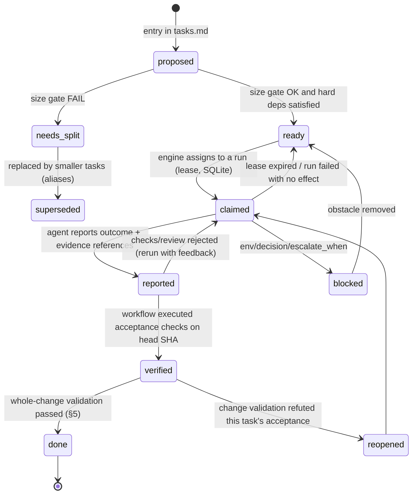
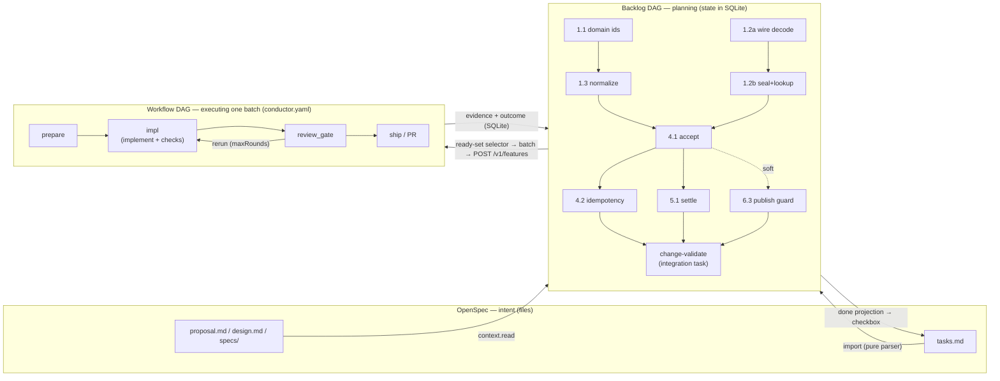

# Small-task contract, backlog DAG vs workflow DAG (Stage 4)

> **Status: design note, NOT an approved plan.** This is the Stage 4
> deliverable of `docs/development-roadmap.md` ("Track B — Stage 4 — small-task
> contract + planning/size gate"). It changes no code, is not an OpenSpec
> proposal, does not choose a graph store (Stage 5) and does not design an
> implementation (Stage 6). Every recommendation here needs its own proposal in
> `openspec/changes/` before it becomes actionable.

Analysis date: 2026-09-29. Read-only sources: this repository and
`/root/Projects/gloam-idle-conductor` (git history, `conductor.yaml`, archived
OpenSpec changes). No pipeline or model was run; neither gloam-idle nor any
existing plan/spec was modified.

## 1. Problem and scope

Today Conductor's unit of work is an **entire OpenSpec change**:

- `plugins/openspec/serve.ts` → `handleStartWork` (l. 323–420) creates one
  feature through `POST /v1/features`, with the title derived from the change
  name, the description from the *Why* section and, optionally,
  `inputs.change_slug`. The plugin reads `tasks.md` only for display
  (`parseTasks`, l. 227) and progress counting (`countTasksFromFile`, l. 82).
  There is no task scheduler and no task-to-task dependency.
- `parseTasks` takes **only the checkbox line**: text wrapped onto
  continuation lines (the `world-map-fog-of-war` style) and indented
  `Evidence:` sub-bullets (the `add-content-driven-unique-items` style) are
  already lost today, in the UI projection.
- The gloam pipeline (`gloam-feature-delivery`, 19 jobs) has a single
  `impl/implement` step whose prompt asks for the whole change: *"tasks.md is
  the ordered checklist — tick each task off and commit per task"*
  (`conductor.yaml`, l. 264–266). Review (`review_*`, `review_gate`) judges the
  whole diff. The agent ticks the checkbox and nobody else verifies it.

Production shows the effect: `masterwork-cross-layer-verification`
(4 tasks) took ~55 min of pipeline time, and the implementer did all 4 tasks
in one 12-minute turn. At 4 tasks that works. At 20–56 tasks you get what
§6.2 shows: one giant turn, evidence written after the fact, and gaps found
only by the whole-change review.

Stage 4 defines:

1. a minimal **small-task contract** (§3);
2. the split between the **backlog DAG** (planning) and the **workflow DAG**
   (execution) (§4);
3. the requirement to **validate the whole change** despite the split (§5);
4. a **test of the contract** on real `tasks.md` files and a real
   decomposition (§6);
5. **questions** for Stage 5, without choosing a solution (§7);
6. the answer to the **decision gate** (§8).

## 2. Governing principles (from `AGENTS.md` and `openspec/config.yaml`)

The contract must not break any of these; every decision below is checked
against them.

| # | Principle | Consequence for the contract |
|---|---|---|
| P-1 | `conductor.yaml` is the **only** execution format | A task carries no steps, gates, retries or routing rules. It says *what* must be true, not *how* to execute it. |
| P-2 | Pure interpreter, engine owns I/O | Ready-task selection, size assessment and status transitions are pure functions over data. Claiming, writing and dispatching belong to the engine/reconciler. |
| P-3 | SQLite is the source of truth; sessions are disposable | A task's **execution** state (claim, runs, evidence, verdict) lives in SQLite. An agent session "remembers" nothing on the system's behalf. |
| P-4 | OpenSpec owns intent/spec/design | The **intent** fields (scope, acceptance, dependencies, context) have one owner: the change's files. The contract creates no second copy of intent. |
| P-5 | Runtime-agnostic | The contract assumes neither the native runner nor ACP. Reports go through the HTTP API / CLI / scoped MCP, which every runner already has. |
| P-6 | `end_turn` is not success (`openspec/specs/acp-execution`, scenario *End turn without report*) | Ending a turn, a commit or a checkbox do not complete a task. Completion is a status transition performed by Conductor based on evidence. |

## 3. The small-task contract

### 3.1 Fields

The contract is **logical**: field names describe meaning, not a table
schema or a file syntax (Stage 5/6 decides those). The *Owner* column says who
may write a field. That is the mechanism that prevents a second source of
truth.

| Field | Meaning | Required | Owner |
|---|---|---|---|
| `id` | Stable identifier within the change: `<change>#<local-id>`, e.g. `add-content-driven-unique-items#4.2`. Does not change when text is edited or tasks are reordered. | yes | intent (OpenSpec) |
| `aliases` | Former identifiers after a split/move (e.g. `add-content-driven-unique-items#12.1` → `masterwork-cross-layer-verification#1.1`). | no | intent |
| `categories` | Repo prefixes (`[core]`, `[db]`, `[impl]`, `[fe-impl]`…). The vocabulary belongs to the repo, not to Conductor. | yes | intent |
| `goal` | One sentence: which observable state of the world is true after the task. | yes | intent |
| `scope.touch` | Modules/paths the task may change (a hint for conflicts and review; not a sandbox). | yes | intent |
| `scope.out` | Explicit non-goals, especially what belongs to another task (`"HTTP routes belong to …"`). | no | intent |
| `acceptance[]` | List of checks. Each has a `statement`, an optional `spec_ref` (capability / requirement / scenario) and a `check`: an **executable** test/command, or `manual` with an approver. | yes (≥1) | intent |
| `depends_on[]` | Backlog edges: `{task, kind: hard\|soft, requires: verified\|merged\|released, reason}` (§3.3). May point at tasks of **other** changes. | no | intent |
| `context.read[]` | What a fresh session **must** read: anchors in proposal/design, spec requirements, ADRs, code paths, artifacts from predecessor tasks (§3.4). | yes | intent |
| `context.inherits` | Inherited context: the change preamble and the section/slice preamble (constraints such as *"zero wire, every existing world byte-identical"*). | derived | intent |
| `batch` | Delivery unit (slice/PR) the task belongs to, e.g. fog-of-war *"Slice 1 — dormant engine"*. A batch has its own constraining preamble and is the unit of review/PR. It is not the unit of agent work. | no (default: the whole change) | intent |
| `authority` | Who may approve completion: `conductor` (default) or `human` (a decision, a purchase, live verification). | yes (defaulted) | intent |
| `escalate_when` | Explicit stop conditions (*"if it is false, stop and re-open ADR-099 D9"*). An agent that meets one reports an escalation, not success. | no | intent |
| `size` | Output of the size gate (§3.6): estimate and verdict. | derived | pure function over intent |
| `status` | Lifecycle (§3.5). | yes | **SQLite** |
| `claim` | Which run/feature executes the task; lease. | — | **SQLite** |
| `evidence` | Executed evidence bound to a SHA (§3.2). | — | **SQLite** (+ git) |
| `followups[]` | Scope discovered during work (§3.7): proposed new tasks with `discovered_from`. | — | **SQLite** as a proposal → intent once accepted |

The checkbox in `tasks.md` is **not a contract field**. It is a *projection*
of `done` from SQLite (§3.5). Today the agent ticks the checkbox itself and
that is the only "evidence" of completion. In the contract the checkbox is
never an input to the completion decision.

### 3.2 Evidence of completion

Evidence is a **fact observed by Conductor**, not agent prose:

```
evidence:
  head: <sha>                     # commit that was checked; must descend from the task's base
  commits: [<sha>…]               # commits belonging to the task (base..head)
  checks:                         # one per acceptance[].check
    - ref: acceptance[2]
      kind: command|test|manual
      command: "./gradlew :player-character:application:test --tests '*AcceptWorkServiceTest*'"
      exit: 0
      log: run_log:<run-id>#<range>  # from run_log, not pasted by the agent
      executed_by: conductor|agent|human
  claimed_by_agent: "…"           # the agent's report: informational, never decisive
```

Rules:

- **Executed evidence > declared evidence.** `executed_by: agent` (the agent
  says it ran something) is informational only. `verified` is decided by a
  re-execution in a workflow `command` step (confirmation-of-effect, applied
  to tasks).
- **"Verified via code inspection — not executed" is not evidence.** If the
  environment cannot run the `check` (e.g. no testcontainers), the task is
  `blocked(env)`, not `done`. In the masterwork base, 8 of 20 tasks carry
  exactly this wording in their Evidence (§6.2).
- Evidence is **bound to a SHA** and immutable. Later code changes do not
  overwrite it; they produce new evidence. This reuses the `reviewHead` /
  `expected_sha` discipline the workflow already has
  (`docs/workflow-reference.md`, *Structured review*, *Bundled commit evidence
  actions*).

### 3.3 Dependencies: hard and soft

- **hard**: the task is not `ready` until the predecessor reaches `requires`.
  The reason must be nameable: *I consume an artifact* (a port, type, table,
  `openapi.json`) or *my `check` cannot pass without it*.
- **soft**: preferred order (conflict risk, sensible review order). The
  scheduler may break it when there is no other work. The section order of
  today's `tasks.md` (*"Keep the natural implementation order"*) imports as
  `soft`.
- `requires`:
  - `verified`: the default; the predecessor passed its own verification on
    the change branch;
  - `merged`: the predecessor is on `main` (cross-change edges, e.g.
    `official-masterwork-content` → the base);
  - `released`: the predecessor is deployed and has soaked (fog-of-war:
    *"Ship in order; let slices 1–2 soak before the content flip"*).
    `released` is not a state Conductor observes on its own. It is a
    dependency on a release-gate task with `authority: human`.

The backlog DAG must be acyclic. A cycle is a planning error reported by pure
validation (as with `needs:` in a workflow).

### 3.4 Context for a fresh session

A fresh session does not know the planning conversation, the other tasks or
previous rounds. It must receive **everything needed to satisfy
`acceptance`**, and nothing more:

1. the change and section preamble (`context.inherits`);
2. **only** the spec requirements/scenarios referenced by
   `acceptance[].spec_ref`, not the whole `specs/` folder;
3. the relevant `design.md` sections (the decisions the task realises);
4. the predecessors' **output contracts**, not their history: port
   signatures, table names, generated types. They must exist **in the repo at
   the task's base commit**, not in another session's memory;
5. the code paths in `scope.touch` and patterns to follow.

The contract test: *would a well-informed engineer who has not seen the other
tasks complete this task and run its `check` themselves?* If they need to know
"how task X was done", either a `hard` edge to an artifact is missing or the
task is cut badly.

`feedback.*` already does this for reruns: a new round has no memory and
receives an explicit snapshot (`docs/concepts.md`, *Feedback: what a new round
knows*). The contract applies the same rule to tasks.

### 3.5 Lifecycle and completion authority



- The **agent** can take a task at most to `reported`. Same as steps today:
  no `conductor_report` = step incomplete, regardless of `end_turn`.
- **Conductor** (the engine, from the workflow's result) moves
  `reported → verified`. Condition: workflow `command` steps executed the
  `acceptance[].check`s on `evidence.head` successfully, and the review gate
  (if any) returned an outcome meaning acceptance. As always, the workflow
  gives outcomes their meaning, not the engine.
- **`done`** is set only after whole-change validation (§5). Until then
  `verified` is provisional.
- **`authority: human`**: the move to `verified` requires the outcome of a
  `human` step (gate). Examples: choosing a provider, paid live verification,
  a product-owner decision.
- **The checkbox in `tasks.md`** is a projection of `done`, written by the
  engine as a side effect (a commit on the change branch). Never the other way
  round. Who physically writes it and when is question Q6 for Stage 5.

### 3.6 Planning / size gate

A task moves `proposed → ready` only if the pure function
`assessTask(task, repoFacts)` returns `ok`. The criteria come from §6.2; the
thresholds are **hypotheses to calibrate**, not a decision:

| Criterion | Starting threshold (hypothesis) | Rationale from the data |
|---|---|---|
| `acceptance[]` non-empty and every `check` executable (or `manual` with `authority: human`) | hard requirement | `retry-policy` 1.1–3.5 have no "verify" clause; the masterwork base had 1.2 and 6.3 with criteria not checkable at the boundary (§6.2) |
| `scope.touch` | ≤ 2 production modules (+ their tests) or 1 layer | Masterwork base commits: 3 to 34 files. The largest (`3bbc687a9`, 4.1+4.2) was 34 files / +1381 |
| Estimated diff (excluding generated files) | ≲ 800 lines | Consistent with the best-closed base commits (105–1224 lines) |
| `context.read[]` | ≲ 10 entries, no "read the whole change" | The gloam implementer currently reads proposal + design + all specs + the whole tasks.md |
| Number of `spec_ref`s | ≲ 5 scenarios | A larger set suggests a cross-cutting task (§5) |
| Oversize signal words | "and wire … and persist … and expose …" in `goal` | Masterwork 8.1: 9 routes + client + tests in one task |

A `needs_split` verdict does not block a human. It only means the scheduler
will not hand that task to an agent as one unit. The size assessment is input
data for the interpreter (P-2); where to compute it is question Q9.

### 3.7 Newly discovered scope (follow-up instead of expansion)

- An agent that discovers work outside `goal`/`acceptance` **does not expand
  the task**. It reports `followups[]`: `{goal, reason, suggested depends_on,
  discovered_from: <id>, blocking: bool}`.
- `blocking: false`: the task can reach `verified`, and the follow-up waits
  as a proposal for a planner/human to approve. This mirrors today's
  *Carry-forward (non-blocking)* findings in the gloam `review_gate`.
- `blocking: true` ("my `check` cannot pass without it"): the task goes to
  `blocked`, not `reported`. It signals that the decomposition missed an edge.
- A task's acceptance is **immutable during execution**. Changing the
  criteria is a new version of intent (an OpenSpec edit), not an agent
  decision. The masterwork base broke this repeatedly: *"Resolve F2:"*,
  *"Resolve F10:"* and a new task 2.4 were added to already-ticked tasks after
  review.

## 4. Backlog DAG vs workflow DAG

### 4.1 Two graphs, two responsibilities

| | **Backlog DAG** | **Workflow DAG** |
|---|---|---|
| Node | task (contract §3) | job in `conductor.yaml` |
| Edge | `depends_on` (hard/soft, `requires`) | `needs:` |
| Question | *what* must be delivered and *in which order* | *how* one unit of work is delivered: design → implement → quality → review → PR → merge |
| Intent owner | OpenSpec (`tasks.md`, `design.md`) | the repo (`conductor.yaml`) |
| State | task status in SQLite (§3.5) | `FeatureState.jobs` in SQLite |
| Lifetime | weeks; grows as follow-ups appear | one feature; static shape |
| Loops | not allowed (reopen is a status transition, not an edge) | only `rerun` with `maxRounds` |
| Shape | depends on the change; unknown before planning | fixed by the workflow author; statically validated |

### 4.2 Mapping

One **feature** (workflow run) executes **one batch** of backlog tasks. A batch
is one task or a small set of `ready` tasks picked by a pure selector. The
workflow does not know how many tasks the change has. It receives the batch as
input data and returns evidence for the batch's tasks.



Relationships:

- **task → job**: never 1:1 by definition. A task does not become a job and
  `depends_on` does not become `needs:`. A workflow may have a static fan-out
  (e.g. three architects in gloam), but its shape is known when
  `conductor.yaml` is written, and the backlog's is not. Core has no dynamic
  fan-out (`matrix`) today. If one were added, it would be for executing a
  batch, not a copy of the backlog (question Q10).
- **batch → feature**: 1:1. One feature executes one batch. Later batches of
  the same change are later features, usually on the same change branch (§5).
- **backlog → workflow**: only through data, i.e. feature `inputs` (task IDs,
  context references) or a projection read by templates (e.g. `{{ task.* }}`).
  The workflow does not see backlog edges.
- **workflow → backlog**: only through the outcome and evidence stored in
  SQLite. The engine translates "job X of feature F ended with outcome Y and
  evidence E" into status transitions of the batch's tasks (§3.5).

### 4.3 Why they must not be merged

1. **Two rule engines.** If `depends_on` became `needs:`, a workflow
   generator fed by the backlog would be a second execution format (breaks
   P-1). Alternatively the backlog would acquire `if:`/`rerun`/gates and become
   a second gate engine (which Stage 6 explicitly forbids).
2. **Different failure semantics.** In a workflow, a failed job *skips* its
   dependents and escalates the feature (`docs/concepts.md`, *Job failure is
   terminal, not fatal*). In a backlog, a failed task *blocks* its dependents
   until repaired but does not make them "skipped". Merging the graphs would
   give a change in which one failed task erases half the plan.
3. **Different loops.** `rerun` is bounded by `maxRounds` and resets the
   downstream closure. Reopening a task after whole-change validation (§5) has
   no round limit from a workflow definition and does not reset independent
   tasks.
4. **Different lifetimes and mutability.** The backlog grows with follow-ups
   and splits (`needs_split → superseded`) while work is in progress. The
   workflow is validated statically and immutable for a feature's lifetime.
   Validating `feedback.*` and `needs.*` (`docs/concepts.md`) would be
   impossible over a graph that changes.
5. **Different owners.** The pipeline's shape belongs to the repo (one
   configuration for all changes); the backlog's shape belongs to a specific
   change. `gloam-feature-delivery` serves every change with the same 19-job
   graph, and should keep doing so.
6. **The interpreter.** The pure interpreter works over `(workflow IR, feature
   state, event)`. Folding the backlog into the IR would change its input from
   "a definition" to "a definition + a dynamic plan", destroying the static
   validatability that `rerun` and `needs.*` rely on.

## 5. Validating the whole change despite the split

Splitting into tasks does not remove the obligation to prove that the
**change as a whole** meets its spec. Evidence from §6.2: all blocking findings
of the masterwork base (F2, F6, F10, plus F8, F27, F28, F29) came out of the
**whole-change** review, not from task verification. Every one of those tasks
had already been ticked.

Requirement (contract, not implementation):

1. **An integration task `change-validate`** is added automatically to every
   change's backlog, with a `hard` edge from every other task in the change and
   `authority: conductor`. Its `acceptance`:
   - the repo's full quality gate on the **combined** head of the change branch
     (in gloam: the whole `quality` step, without the "changed files" filter
     narrowed to the batch);
   - **scenario coverage**: every scenario in the change's delta specs has at
     least one `acceptance[].spec_ref` in a `verified` task, or an explicit
     `waived` with `authority: human`. This is a pure check over intent and
     evidence, with no model involved;
   - a whole-change review: the `base…head` diff of the entire change, judged
     against proposal/design/specs by the review jobs the workflow already has.
2. **Where:** in the workflow, as an ordinary job/batch. It is not a new
   mechanism. A batch consisting only of `change-validate` runs the same
   review → PR → merge path. A workflow may also select a separate integration
   pipeline via `inputs` (to be decided in Stage 6).
3. **When:** always before the **change's** PR/merge to `main`. Additionally,
   optionally at a `batch` boundary when batches are separate PRs: each batch
   PR ends with the quality gate of its own diff, and `change-validate` still
   runs at the end.
4. **Outcome:** a finding from the whole-change review that points at a
   `verified` task moves it to `reopened` (§3.5), with the finding as feedback.
   New scope becomes a follow-up (§3.7). `done` is set for all tasks of the
   change, including `change-validate`, together.
5. **Cross-change dependencies.** Validation of change B that depends on A
   (`requires: merged`) runs on `main` that already contains A. B does not
   revalidate A, but its `change-validate` covers regressions at the seam (as
   `masterwork-cross-layer-verification` did).

## 6. Testing the contract on real data

### 6.1 (a) Does the contract describe existing `tasks.md` files without losing information?

Three changes with different styles:

| Change | Repo | Tasks | Style |
|---|---|---|---|
| `retry-policy` | conductor_v2 (active) | 25 | numbered, prefixed, single line; inline *"(Done: …)"* notes |
| `2026-08-03-world-map-fog-of-war` | gloam | 56 | **unnumbered**, slices as sections, per-module sub-sections, continuation lines, stop conditions in the text |
| `2026-09-23-add-content-driven-unique-items` (post-split state) | gloam | 20 | numbered, *"Resolve Fn:"*, indented `Evidence:` sub-bullets, a preamble and a *Recovery handoff* section outside the tasks |

Plus `2026-09-29-acp-runner` (this repo, 33 tasks) as a case of preambles with
**section owners and exclusive file ownership** (*"owner B … Exclusive
ownership: server/src/{store,…}.ts"*) and an explicit section dependency map
(*"A → (B || C || D || F test authoring)"*).

Mapping source element → contract field:

| Source element | Example | Field | Notes |
|---|---|---|---|
| task number | `4.2` | `id` = `<change>#4.2` | — |
| no number | fog-of-war | `id` = `<change>#<slice>.<n>`, derived **once** on import and stored | without storing it the ID would change on every edit; a real gap in today's format (Q3) |
| prefixes | `[impl][db][test]` | `categories` | repo vocabulary; gloam uses different ones than conductor_v2 (`[fe-impl]`, `[ddd]`, `[gate]`) |
| sentence before "verify" | *"Implement acceptance idempotency…"* | `goal` + `scope` | — |
| "verify …" clause | *"verify lost-response retries cause one work…"* | `acceptance[].statement` | the `check` (command/test) **does not exist** in the source: the one field that cannot be filled from the text (see below) |
| "belongs to X / owned by Y" | *"HTTP routes belong to masterwork-client-surface"* | `scope.out` | — |
| "Only after 11.1 resolves…" | provider 11.2 | `depends_on: {11.1, hard, verified}` | — |
| "Publication compatibility itself is owned by 6.3" | base 3.3 | `depends_on: {6.3, soft}` + `scope.out` | — |
| section order / *"Keep the natural implementation order"* | all | `depends_on: soft` | — |
| *"Depends on section 1"* / *"A → (B‖C‖D)"* | acp-runner | `depends_on: hard` at batch level | section→section edges expand to tasks |
| *"let slices 1–2 soak before the content flip"* | fog-of-war | `depends_on: {requires: released}` + a gate task with `authority: human` | — |
| change/section preamble | *"zero wire, every existing world byte-identical"* | `context.inherits` + `batch` | a global constraint for every task in the batch |
| *"Exclusive ownership: …; do not edit …"* | acp-runner owner B | `scope.touch` / `scope.out` | — |
| *"if it is false, stop and re-open ADR-099 D9"* | fog-of-war `[ddd]` | `escalate_when` | — |
| *"Record the confirmation in design.md"* | fog-of-war `[arch]` | `acceptance[]` with `check: manual` + artifact | a "confirm" task has evidence too |
| PO decision / cost authorization | provider 3.1–3.4 | `authority: human` | — |
| `[review]`, `[gate]`, `[fix]` | fog-of-war, retry-policy 5.3–5.4 | **not backlog tasks**: workflow steps, or `acceptance` of the batch / `change-validate` | the entry is kept as a reference in `change-validate`, so nothing is lost |
| `- Evidence: …` (sub-bullet) | base 1.1–6.3 | `evidence.claimed_by_agent` | historical prose, **not** executed evidence (§3.2) |
| inline *"(Done: …)"* | retry-policy 3.1, 4.1, 5.2 | `evidence.claimed_by_agent` | same |
| checkbox `[x]` | all | projection of `status=done` | on historical import: `done(legacy-unverified)` |
| *"Resolve F10:"* | base 1.2, 2.4, 6.3 | link to the finding + a new `acceptance` version | exposes acceptance mutated after the fact (§3.7) |
| *Recovery handoff* (stash SHA, prohibitions) | base | `context.inherits` for `artwork-and-naming` tasks | non-task content, but binding |
| *Implementation notes* after sections | artwork-and-naming | `context.read` for dependent tasks | — |
| *Status summary* / *Billing reconciliation* | provider | state and `authority: human` decisions | operational narrative; in the contract split into status + `manual` evidence + a note |

**Result (a): the contract is sufficient**: every element of the three (four)
files has a place in it. Importing from text is **not automatically complete**,
though. There are three gaps; none comes from the contract, all are gaps in the
source:

1. **`acceptance[].check`** (a command) barely exists in the sources. In the
   masterwork base, commands appear only in `Evidence`, written after the fact
   (*"Verified via `:player-character:application:test`"*). Import can mark
   `check: unspecified`, and the size gate (§3.6) will treat such a task as not
   ready.
2. **Stable IDs** for unnumbered changes (fog-of-war): they must be derived
   and stored.
3. **`context.read`** is implicit today ("read the whole change"). Import can
   set a safe default (preamble + proposal + design + specs), but that is
   exactly the "one giant context" that decomposition is meant to remove.

Conclusion: no information is lost, but **existing `tasks.md` files are not
yet executable contracts**. They lack checkability and targeted context.
Moreover, today's parser (`parseTasks`) drops continuation lines and
sub-bullets, so even the UI projection is lossy.

### 6.2 How a large change actually fell apart: `add-content-driven-unique-items`

Timeline from the gloam-idle git history:

| Date | Event |
|---|---|
| 09-17/18 | proposal `0cf1a95f9`: **37 tasks in 12 sections**, 4 capabilities, 21 requirements, 75 scenarios |
| 09-19 23:52 → 09-20 12:15 | 11 implementation commits for sections 1–5 (3 to 34 files, +105 to +1381 lines) |
| 09-20 15:17 | `b660b7d68` *tick tasks 6.1-6.3*. In this commit `PostgresPublishedContentUsageGuard` hard-codes `val proposedDeclaredRefs: Set<String>? = null`, i.e. the 6.3 guard **never checks anything**, and the task is ticked |
| 09-20 19:02 | `4274c1621` manual split: sections 7–12 removed from the base |
| 09-22 07:22 | the whole-change review reveals F2 (bundle wiring: without it 1.2 was only domain constructors), F6 (inert 6.3 guard), F10 (generated stats dropped on delivery) and **F1**: the split removed requirements while the successors did not exist, so archiving *"would have permanently dropped those requirements"* |
| 09-22 | `a1ff859b1` creates 5 successor changes; in the base **every task is unticked**: *"prior … historical checkmarks are not verification evidence"* |
| 09-23 | F8/F27/F28/F29 from the whole-change review; merge #543 (**329 files, +19,619 lines**) |
| 09-24 → 09-29 | successors: #546 (+4471), #547 (+8609), #549 (**+25,810**), #551 (+8526), #553 (+811) |

Lessons for the contract:

- **L1: a checkbox is not evidence.** 6.3 was ticked with an inert guard; 1.2
  without a public path. Both gaps were caught only by the whole-change
  review. → §3.2, §3.5, §5.
- **L2: acceptance was not checkable at the boundary.** The original 1.2
  (*"verify official and community bundle fixtures use the same … surface"*)
  could be "met" by a constructor test. The F2 fix added *"not merely domain
  constructors … survive seal/reload"*. → `acceptance` with a `check` at the
  public boundary.
- **L3: splitting into changes ≠ decomposing into tasks.** The manual split
  cut the plan along **delivery layers** (base / artwork / client / content /
  provider / verification), which is a good backlog DAG *between* changes. The
  base itself remained one unit of execution (20 tasks, +19.6k lines in one
  PR), and the client was +25.8k lines in one PR.
- **L4: a split must preserve requirements.** F1 is loss of intent during a
  move. The contract requires `aliases` and a scenario-coverage check (§5) at
  split time too, not only at validation time.
- **L5: hidden edges.** 3.3 → 6.3 (*"Publication compatibility itself is owned
  by 6.3"*), 5.4 → artwork 2.1 (naming), 6.1 → 2.4 (F10). Some edges existed
  only in prose and in the planner's head.
- **L6: cross-cutting tasks (1.2, 4.1, 5.x) span many modules** (content-model,
  bundle-format, world-authoring, simulation, runtime, player-character). One
  task = one session = several modules is the "one giant turn" recipe at a
  smaller scale.

### 6.3 (b) Decomposing `add-content-driven-unique-items` under the contract

This change was chosen over `world-map-fog-of-war` because it has an explicit
manual decomposition to compare against (6 changes + a successor map), known
verification failures (F1/F2/F6/F10) and a complete commit history. Fog-of-war
is used as a counter-example in §6.5.

Input: the original proposal `0cf1a95f9` (37 tasks) plus decisions that
appeared later (F2/F6/F10, F8 auto-delivery, the F28 eligibility/mixing
split). Result: the base in 6 batches B1–B6 (**29 tasks** instead of 20 from
sections 1–6), plus 26 successor tasks and the integration task X, **56 tasks**
in total instead of 37 (`batch` ≈ PR). Full contracts of three representative
tasks are in §6.4; the rest are in the tables, where the *check* column is the
boundary at which the task is verified.

Notation: `→` hard edge (`requires: verified` unless stated), `⇢` soft.
Modules: `cm` content-model, `bf` bundle-format, `wa` world-authoring, `sim`
simulation, `pc` player-character (d=domain, a=application, pg=adapter-postgres,
http=adapter-http), `rt` runtime, `web` clients/web.

**Batch B1: content and domain contracts (zero wire, zero DB)**

| ID | Goal | touch | hard deps | check (boundary) | source |
|---|---|---|---|---|---|
| B1.1 | `Work` domain types: `WorkId`, `WorkSource` (PlayerCreated/NonPlayer), `GeneratedOutcome`, `WorkLifecycle` | pc-d | — | `:player-character:domain:test` (construction, no fabricated authorship) | 1.1 |
| B1.2 | Project contract types in `cm`: material roles, counts, eligibility **and separately** mixing, additive limits, access/quality, `CreationQuotaDef`, capacity, disclosure variants | cm | — | `:content-model:test`: invalid combinations rejected in factories | 1.2 (part), F28 |
| B1.3 | Assignment normalization and combined stock claims | pc-d | B1.2 | property tests: permutations, duplicates, cross-role overspend | 1.3 |
| B1.4 | Plan script contract (pure, bounded) + plan validation | sim | B1.2 | `:simulation:*:test`: oversized/invalid/unsupported → typed errors | 2.1 |
| B1.5 | Deterministic plan sampling and immutable result with provenance | sim, pc-d | B1.4, B1.1 | replay equality; no hidden draws | 2.2 |
| B1.6 | Disclosure projection (marginals by effect label, correlated groups) from the same plan | pc-a | B1.5 | application tests: changed inputs change values, external odds rejected | 2.3, F8 |
| B1.7 | Interpretation of `generatedStats`/`abilityParameterRetainBp` from the plan (decoded once, fail-closed) | pc-a | B1.5 | test: a parameter for an unselected ability is rejected | 2.4 (F10, part) |
| B1.8 | Masterwork ability contract (`condition` + `replacementAttack` + retain range), no reactive fields | cm | — | `:content-model:test` supported shapes | 6.2 (part) |

**Batch B2: the public bundle path (F2 as first-class tasks)**

| ID | Goal | touch | hard deps | check | source |
|---|---|---|---|---|---|
| B2.1 | Wire types `MASTERWORK_PROJECT_DEF`/`_ABILITY_DEF` + strict decode + mapping to domain | bf | B1.2, B1.8 | `:bundle-format:test`: round-trip, unknown field rejected | 1.2, 6.2, F2 |
| B2.2 | New `WireDeclaration` variants in every exhaustive `when` (addressing, identity, catalogs) | bf, wa, rt | B2.1 | compile the whole `app/` + `detekt` | F2 (`cea4124ed` shows this is a separate, mechanical piece) |
| B2.3 | Structural and reference validation + localization keys in `wa` | wa | B2.1 | `MasterworkPublishValidationTest`: community fixture, malformed contracts rejected | 1.2, F2 |
| B2.4 | Seal/reload and runtime lookup (`ContentView` + `rt` resolvers) | sim, rt | B2.3 | test seal → re-decode → `verifySeal` → lookup | 1.2, F2 |
| B2.5 | Rejection of unsupported mechanics (reactive armor, AI, charges) **at the bundle boundary** | bf | B2.1 | `MasterworkWireTest` via `fromKindAndJson` | 6.2, F29 |

**Batch B3: persistence and identity (DB)**

| ID | Goal | touch | hard deps | check | source |
|---|---|---|---|---|---|
| B3.1 | Migration removing `uq_item_instance_unique_world_def` + in-memory parity | pc-pg, pc-d | B1.1 | instance repository integration test (testcontainers) | 3.1 |
| B3.2 | `work`/`work_illustration`/`quota_usage` tables, strict columns without defaults, versions | pc-pg | B1.1, B1.5 | round-trip + schema-drift rejection (testcontainers) | 3.2 |
| B3.3 | `generatedStats`/`retainBp` columns + codecs | pc-pg | B3.2, B1.7 | round-trip with non-empty values | 2.4 (F10, part) |
| B3.4 | Character-local unit of work (lock order, one transaction) | pc-pg | B3.2 | rollback on stale version | 3.3 |
| B3.5 | Used-ability-reference reader (works ∪ delivered items) | pc-pg | B3.2, B3.3 | integration test: completed-undelivered counts | 3.3 (part) |

**Batch B4: atomic acceptance**

| ID | Goal | touch | hard deps | check | source |
|---|---|---|---|---|---|
| B4.1 | `acceptForSource` orchestration (Player and NonPlayer): validation order, generation outside the transaction | pc-a | B1.3, B1.5, B1.6, B3.4, B2.4 | `AcceptWorkServiceTest`: no effects at any boundary; NonPlayer without fabricated author | 4.1, F27 |
| B4.2 | Request idempotency (normalized identity + terms hash) | pc-a | B4.1 | lost response, identity conflict, reconfirmation | 4.2 |
| B4.3 | Races: last shared/per-craft quota, stock, place, capacity lowered 3→1 | pc-pg (test) | B4.1 | concurrent integration test (testcontainers) | 4.3 |

**Batch B5: durable work and delivery**

| ID | Goal | touch | hard deps | check | source |
|---|---|---|---|---|---|
| B5.1 | `Working` activity: pause/resume/switch, settle-before-switch | pc-d, pc-a | B4.1 | `WorkSettlementServiceTest` (no credit for paused time) | 5.1 |
| B5.2 | Offline cap and restart | pc-a | B5.1 | split/capped settles; reload (testcontainers) | 5.2 |
| B5.3 | Completion: release slot and capacity without refunding quota | pc-d, pc-a | B5.1 | test "completion frees capacity…" | 5.3 |
| B5.4 | Delivery: deterministic instance ID, atomic write, IDOR, no loot forfeiture; B3.3 stats applied over the template | pc-a, pc-pg | B5.3, B3.3 | `WorkDeliveryServiceTest` + idempotent insert | 5.4, 2.4 (F10) |
| B5.5 | Auto-delivery on completion (best-effort, full bag = awaiting) | pc-a | B5.4 | F8 test through the real settle path | F8 |

**Batch B6: combat and publication compatibility**

| ID | Goal | touch | hard deps | check | source |
|---|---|---|---|---|---|
| B6.1 | Ability resolution at the fight's content pin + `retainBp` scaling | pc-a, combat | B5.4, B2.4 | `MasterworkAbilityResolutionTest` (pin, no silent drop) | 6.1, F10 |
| B6.2 | Publication guard: decode the **proposed** declarations, removed/incompatible, advisory lock shared with acceptance | rt, wa-d | B3.5, B2.4, B4.1 | `PostgresPublishedContentUsageGuardIntegrationTest`: removing a used ability is **refused and the version unchanged** | 6.3, F6 |
| B6.3 | Publication ↔ acceptance race (both orderings) | rt (test) | B6.2 | concurrent integration test | 6.3 |

**Successor batches** (here the manual split was good as a cross-change
backlog; the contract only splits them more finely):

| ID | Goal (summary) | hard deps | source |
|---|---|---|---|
| A1.1–A1.4 | Illustration worker: queue + lease; brief from facts; media validation; retrieval authorization | B3.2, B5.3 | 7.1–7.3 (7.1 split into queue and worker) |
| A2.1–A2.2 | One-time naming (domain + moderation/port); observability | A1.x, B5.4 | 7.4–7.5 |
| C1.1–C1.4 | HTTP routes **per resource**: catalog/preview; accept; works list/details/pause/resume/deliver; artwork/name | B4.2, B5.5, A2.1 | 8.1 (split) |
| C1.5 | Pre-completion redaction on every projection | C1.1–C1.4 | 8.2 |
| C1.6 | OpenAPI annotations + snapshot and client type regeneration | C1.1–C1.5 | 8.3 |
| C2.1–C2.4 | Web: selection/preview; acceptance; list/details; presentation/naming | C1.6 (**artifact: `openapi.json` + generated types**) | 9.1–9.4 |
| O1.1–O1.3 | Official content; Protected policy; benchmarks | `requires: merged` on B2.x, B6.2 | 10.1–10.3 |
| P1.1 | Provider ADR | `authority: human` | 11.1 |
| P1.2 | Real adapter | P1.1 (human) | 11.2 |
| P1.3 | Paid live verification | P1.2, `authority: human`, `escalate_when: no cost authorization` | 11.3 |
| V1.1–V1.2 | Cross-layer regressions | everything above (`requires: merged`) | 12.1–12.2 |
| D1.1–D1.2 | Intent documentation; client README | V1.x ⇢ | 12.3–12.4 |
| **X** | `change-validate` for every change (§5) | every task of the change | new |

Size gate on this backlog: tasks of the original that **would not pass**
(`needs_split`): 1.2 (4 modules + a public contract: now B1.2 + B2.1–B2.4),
2.4 (crosses generation, DB and delivery: B1.7 + B3.3 + B5.4), 3.3
(coordination + reader for publication: B3.4 + B3.5), 6.3 (guard + race:
B6.2 + B6.3), 7.1 (queue + worker + recovery), 8.1 (9 routes + client), 12.1
(e2e across 7 aspects; splitting is optional here because the task is a
cross-cutting test by nature). The remaining tasks fit the §3.6 thresholds
once a `check` and `context.read` are added.

### 6.4 Three full contracts (a sample of "context for a fresh session")

```yaml
id: add-content-driven-unique-items#B2.4
batch: B2-public-bundle-path
categories: [impl, test]
goal: >
  A masterwork project and ability declared in a sealed bundle is returned by
  runtime lookup after seal and reload, for community and official bundles alike.
scope:
  touch: [app/simulation, app/runtime/.../composition/SimulationMasterwork*Resolver.kt]
  out:   ["publication compatibility guard (B6.2)", "acceptance (B4.1)"]
acceptance:
  - statement: community fixture → seal → JSON re-decode → verifySeal → lookup returns the project
    spec_ref: unique-item-generation/"Generation is source-independent…"/"Community content uses the official surface"
    check: "./gradlew :world-authoring:application:test --tests '*MasterworkPublishValidationTest*'"
  - statement: no official-only branch in the masterwork pipeline
    check: "! git grep -nE 'isOfficial' -- app/**/masterwork* app/**/Masterwork*"
depends_on:
  - {task: B2.3, kind: hard, requires: verified, reason: "consumes validated Bundle projection"}
context:
  read:
    - design.md#"Domain boundaries and selected archetypes"
    - specs/unique-item-generation/spec.md#"Generation is source-independent and content-driven"
    - app/bundle-format/.../WireDeclaration.kt           # contract produced by B2.1/B2.2, present at base
    - app/runtime/.../composition/SimulationEquipmentRulesResolver.kt  # existing pattern to follow
authority: conductor
```

```yaml
id: add-content-driven-unique-items#B6.2
batch: B6-combat-and-publication
categories: [impl, db, test]
goal: >
  Publishing a bundle that removes a used masterwork ability, or excludes a persisted
  parameter, is refused and leaves the published version unchanged.
scope:
  touch: [app/runtime/.../PostgresPublishedContentUsageGuard.kt, app/world-authoring/domain/.../MasterworkAbilityCompatibility.kt]
  out:   ["race orderings (B6.3)"]
acceptance:
  - statement: proposed declarations are decoded from the proposed bundle (never null/inert); decode failure = refuse
    check: "./gradlew :runtime:test --tests '*PostgresPublishedContentUsageGuardIntegrationTest*'"
  - statement: a compatible republish under the same id succeeds
    spec_ref: unique-item-generation/"Publication preserves referenced ability contracts"/"A compatible ability fix is published"
    check: (same test class, named case)
  - statement: removal refused, stored sealed_bundle row unchanged
    spec_ref: unique-item-generation/"Publication preserves…"/"A used ability is removed"
    check: (same)
depends_on:
  - {task: B3.5, kind: hard, reason: "reads used refs + persisted parameters"}
  - {task: B2.4, kind: hard, reason: "decodes proposed declarations through WireDeclaration"}
  - {task: B4.1, kind: hard, reason: "shares the per-world advisory lock with acceptance"}
context:
  read:
    - design.md#"Immutable parameters, updatable shared abilities"
    - specs/unique-item-generation/spec.md#"Publication preserves referenced ability contracts"
    - app/player-character/application/.../UsedMasterworkAbilityRefsReader.kt
    - app/world-authoring/application/.../PublishBundleUseCase.kt
authority: conductor
escalate_when: "testcontainers unavailable → blocked(env), never done"
```

```yaml
id: masterwork-client-surface#C2.1
batch: C2-web-flows
categories: [fe-impl, test]
goal: >
  A player selects a project, fills required roles and additives, and sees a
  disclosure-aware preview; a stale preview never overwrites a changed draft.
scope:
  touch: [clients/web/src/features/masterwork/, clients/web/src/api/masterwork.ts]
  out: ["acceptance confirmation (C2.2)", "any server change"]
acceptance:
  - statement: normalized draft, all three disclosure modes, missing roles, out-of-order previews
    spec_ref: masterwork-client-surface/…/(scenarios for selection and preview)
    check: "cd clients/web && pnpm test src/features/masterwork && pnpm typecheck && pnpm lint"
depends_on:
  - {task: C1.6, kind: hard, requires: verified,
     reason: "consumes regenerated openapi.json + generated client types (artifact at base)"}
context:
  read:
    - openspec/changes/masterwork-client-surface/design.md#"Client and transport"
    - openapi/openapi.json#/paths/~1v1~1worlds~1{worldId}~1masterwork-projects
    - clients/web/README.md#"Screens & navigation"
    - clients/web/src/features/<existing scoped-query feature>/   # pattern
authority: conductor
```

Each of these contracts can be executed and verified without knowing the
other tasks. Everything the session needs from other tasks is an **artifact in
the repo at the base commit** (`WireDeclaration.kt`,
`UsedMasterworkAbilityRefsReader.kt`, `openapi.json`), not knowledge of how
those sessions went.

### 6.5 Comparison with the manual split

| Aspect | Manual split (6 changes) | Decomposition under the contract |
|---|---|---|
| Boundaries between changes | base / artwork / content / client / provider / verification | **the same**; the manual split was a good backlog DAG *between* changes, and the contract does not change it |
| Cross-change dependencies | prose: *"Depends on…"*, an ownership table in `design.md` | `depends_on` with `requires: merged`; `aliases` (`#12.1` → `cross-layer#1.1`) instead of "Owns original 12.1–12.2 as 1.1–1.2" |
| Size of the execution unit | the whole change (base: 20 tasks, +19.6k lines; client: 7 tasks, +25.8k lines) in one implementer turn + a review loop | a batch ≈ 3–8 tasks; each task a separate session with its own `check` |
| F2 (bundle wiring) | found by the whole-change review, 3 days after 1.2 was ticked | five B2.x tasks checked **at the public boundary**; 1.2 as originally worded fails the size gate (§3.6) |
| F6 (inert guard) | ticked with `proposedDeclaredRefs = null` | B6.2 `verified` requires an executed test "removal refused, version unchanged"; an inert guard cannot pass |
| F10 | task 2.4 added after review | B1.7/B3.3/B5.4/B6.1 with edges; the data flows through four tasks, each checking its own segment |
| F1 (requirements lost during the split) | caught by review | scenario coverage in `change-validate` (§5) and `aliases`; the loss is mechanically detectable |
| Evidence | `Evidence` prose written by the agent, 8/20 "not executed in this sandbox" | evidence executed by the workflow on a SHA; `blocked(env)` instead of "code inspection" |
| Successor map | in the base's `design.md` (good, but one-off and manual) | follows from the data (edges + `aliases`) |

Summary: the manual split solved **planning between changes** well, but did
not solve the **size of the execution unit** or **task verification**. That is
why the base was still one "giant turn" (+19.6k) and the gaps surfaced in the
whole-change review. The contract does not replace the manual split; it
complements it one level down.

The `world-map-fog-of-war` counter-example (56 tasks) shows that good
decomposition is possible without new tooling. Its slices are delivery units
with sharp preambles (*"zero wire, every existing world byte-identical"*), the
design pre-flight was done up front (ADR-099), and PRs #440–#442 were
+2.9k–+6.8k lines each. The contract formalises that practice (`batch`,
`context.inherits`, `requires: released`, `escalate_when`) rather than
inventing it. The cost is checkability: ~30% of fog-of-war's tasks are
`[review]`/`[gate]`/`[docs]`/`[arch]` confirmations, which in the contract are
workflow steps or `manual` tasks, not implementer work.

### 6.6 Assessment: can each task be done and verified in one session without knowing the others?

Assessment of the 56 tasks in §6.3:

| Class | Count | Verdict | Condition |
|---|---|---|---|
| Domain/application with a unit test or an application test with fakes (B1.*, B4.1–4.2, B5.1, B5.3–5.5, B6.1, A1.x, A2.x, C2.x) | 25 | **yes** | predecessors delivered an **artifact** (type/port/generated contract) at the base commit |
| Wire/bundle/validation (B2.*) | 5 | **yes** | B2.2 is mechanical and its `check` is compiling everything, so the session must be able to build the whole `app/` |
| DB and races (B3.*, B4.3, B5.2, B6.2–6.3) | 9 | **yes, if the environment allows** | the `check` needs testcontainers. Without them the task is `blocked(env)`, not `done`. This is exactly where the masterwork base claimed "code inspection" |
| HTTP per resource (C1.1–C1.5) | 5 | **yes** | a shared routes file can cause conflicts between parallel tasks; a `soft` edge or a "one batch at a time" rule for that module |
| Contract generation (C1.6) | 1 | **yes** | by nature it integrates C1.1–C1.5 and is the bottleneck before C2.* |
| Official content (O1.1–O1.3) | 3 | **yes** | the `check` is bundle validation and deterministic benchmarks; O1.3 also needs a human balance review (`manual`) |
| `authority: human` (P1.1–P1.3) | 3 | **yes, but not by the agent alone** | the session prepares the evidence; `verified` comes from a `human` gate |
| Cross-cutting (V1.1–V1.2, X `change-validate`) | 3 | **partly** | a cross-cutting test *by definition* needs the context of every layer. The context is in the repo (code + specs), but `context.read` is wide. Acceptable, because these are verification tasks, not implementation tasks |
| Documentation (D1.x) | 2 | **yes** | the `check` is `manual`, or a link/screen-coverage check |

Remaining main risks:

- **Hidden intent knowledge.** Some decisions exist only in `design.md` prose
  (e.g. the lock order "character → inventory → …" for B3.4). `context.read`
  must point at them with an anchor, so design.md paragraphs must be
  addressable (Q4).
- **Conflicts in shared files** (`WireDeclaration.kt`, routes, DI modules).
  The contract only has `scope.touch` and a `soft` edge for this, not a
  mechanism. That is a scheduler concern (Stage 6), not a contract one.
- **Edges the planner did not notice** (L5). The contract will not find them.
  `followups[blocking: true]` will expose them, and that is feedback to
  planning, not its automation.

## 7. Open questions for Stage 5 (graph store)

No solution is chosen. Each question follows from a specific contract field
or rule and gives an evaluation criterion for: (a) native SQLite, (b) Beads,
(c) a provider interface.

| # | Question | Derived from | Evaluation criterion |
|---|---|---|---|
| Q1 | Where does a task's **intent** (`goal`, `acceptance`, `depends_on`, `context`) live: only in OpenSpec files, or also in the store? If also, who wins when they diverge? | P-4, §3.1 *Owner* column | Can the solution be built so that intent has **one** writer, and the store holds at most a projection of it (reproducible from the files)? |
| Q2 | Where does **execution state** (`status`, `claim`, `evidence`) live? | P-3, §3.5 | Is the state in the same database and transaction as `feature`/`run`/`finding`, so that "run finished → task `reported`" is atomic? If not, what is the reconciliation procedure and who arbitrates? |
| Q3 | How are **stable task IDs** guaranteed when `tasks.md` is edited (reordering, splitting, text changes, no numbering)? | §3.1 `id`, §6.1 gap 2 | Does the ID survive text edits and a move to another change (`aliases`)? Does it require writing something back into the file? |
| Q4 | How is **context** addressed (anchors in design/spec, predecessor artifacts), and how is its existence at the base commit checked? | §3.4 | Does the solution store references rather than copies of content (no second copy of intent)? |
| Q5 | How are **cross-change edges** (`requires: merged/released`) and archived changes modelled? | §3.3, §6.3 | Does the graph survive OpenSpec archiving (`changes/` → `changes/archive/<date>-…`)? |
| Q6 | Who **writes the checkbox** into `tasks.md` (the `done` projection) and when? On the change branch, on `main`, or not at all? | §3.5 | Is the projection an engine side effect (P-2), idempotent and reproducible from SQLite state? |
| Q7 | Who has **completion authority** in practice when an external tool (e.g. Beads) has its own `close`? | P-6, §3.5 | Can closing tasks outside Conductor be **disabled**, or treated purely as `reported`? |
| Q8 | How are **claims/leases** recorded and run ↔ task linked, so that a daemon restart neither loses nor duplicates a claim? | §3.5 `claimed`, lease | Is the lease durable and covered by the same reconciler as `run`? |
| Q9 | Where are the **size gate** and batch selection computed (a pure function in `@conductor/core` over the import vs. logic in the store)? | P-2, §3.6 | Can the batch selector and `assessTask` be unit-tested without a database or a model? |
| Q10 | Does the workflow need **dynamic fan-out** over a batch's tasks, or is a batch executed sequentially by one job enough? | §4.2 | The answer must not introduce a copy of the backlog into the workflow IR (§4.3). Criterion: no second rule engine |
| Q11 | How are **follow-ups** stored in the "proposal" state before they become intent in `tasks.md`? | §3.7 | Can a proposal exist only in SQLite until a human/planner accepts it, without being appended to files automatically? |
| Q12 | How are findings from the whole-change review linked to tasks (`reopened`)? | §5 item 4 | Can a `finding` (already in SQLite) reference `task.id` without duplicating the findings lifecycle? |
| Q13 | What is the operational cost (an extra process, a repo format, data versioning such as Dolt) relative to the benefit? Has Beads' current architecture been verified on the decision date? | roadmap Stage 5 | Self-hosted, no hard-coded paths; a pilot on one real backlog (e.g. §6.3) before deciding |

Constraint shared by every option: **no solution may create a second source of
truth parallel to SQLite (state) or to `tasks.md`/OpenSpec (intent)**. An
option that does not guarantee this by construction must explicitly define:
claims, run↔task mapping, reconciliation and completion authority (the
roadmap's requirement for Stage 5).

## 8. Stage 4 decision gate

> *Was the example large change split into small, independently verifiable
> tasks with full context for a fresh session?*

**Answer: yes for the decomposition in §6.3–6.4, with two conditions. No for
the split actually used in gloam-idle.**

- **Manual split (what actually happened): NO.** Six changes are a good
  backlog between changes, but the execution unit stayed too large (base
  +19.6k lines, client +25.8k lines in one PR / implementer turn), and the
  tasks were not independently verifiable: a checkbox and `Evidence` prose
  instead of executed evidence. Hence F2/F6/F10 and F1 surfacing only in the
  whole-change review.
- **Decomposition under the contract (§6.3): YES.** 56 tasks: 29 in 6 base
  batches, 26 in successor batches, and the integration task. Each has an
  executable `check` at the right boundary, explicit hard edges justified by
  an artifact, and a `context.read` pointing at artifacts present at the base
  commit. 50 of the 56 tasks (including 9 DB tasks subject to condition 1
  below) pass the "fresh session with no knowledge of other tasks" test. The
  exceptions (V1.x, `change-validate`, `authority: human` tasks) are
  exceptions by definition and say so explicitly in their contracts.

**Conditions (to fix before Stage 5), without which the "yes" is not
credible:**

1. **The environment runs the `check`s.** DB/race tasks are independently
   verifiable only if the workflow can run their tests (testcontainers).
   Otherwise the contract honestly yields `blocked(env)`, but the task stops
   being "verifiable in one session". Before Stage 5, a pilot must confirm that
   the target pipeline runs every `check` class in §6.6.
2. **The §6.3 decomposition is on paper.** It shows the contract is
   *sufficient* to describe a good decomposition, but it was not executed.
   Calibrating the size-gate thresholds (§3.6) and the fresh-session test needs
   at least one pilot on a real, **new** change: hand-written task contracts +
   the current pipeline run per batch, with no new code in Conductor. The pilot
   should also measure a batch's time and cost against the reference of
   4 tasks / ~55 min.

What this gate does **not** decide: the store (Stage 5), the scheduler,
workflow fan-out, or changes to the OpenSpec plugin (Stage 6).

## 9. Sources

Conductor (this repository):
- `docs/development-roadmap.md`: Track B, Stages 4–6.
- `plugins/openspec/serve.ts`: `countTasksFromFile` (l. 82), `parseTasks`
  (l. 227), `CHANGE_INPUT_NAMES`/`resolveChangeInput` (l. 297–321),
  `handleStartWork` (l. 323–420).
- `openspec/specs/openspec-plugin/spec.md`: *Work can be started from the panel*.
- `openspec/specs/acp-execution/spec.md`: scenario *End turn without report*.
- `docs/concepts.md`: *Jobs: the DAG*, *Job failure is terminal, not fatal*,
  *Loops: rerun*, *Feedback: what a new round knows*.
- `docs/workflow-reference.md`: `needs`, *Structured review and concise fix
  rounds*, *Bundled commit evidence actions*.
- `packages/core/src/types.ts`: `WorkflowDef`, `FeatureState`, `JobRuntime`
  (no `matrix`/dynamic fan-out).
- `openspec/changes/retry-policy/tasks.md`,
  `openspec/changes/archive/2026-09-29-acp-runner/tasks.md`.

gloam-idle (`/root/Projects/gloam-idle-conductor`, read-only):
- `conductor.yaml`: `gloam-feature-delivery`, job `impl` (prompt l. 252–275,
  *"tick each task off and commit per task"*), `review_gate` (l. 843–945).
- `openspec/changes/archive/2026-09-23-add-content-driven-unique-items/`
  (proposal, design with the ownership table, tasks with `Evidence`).
- Original proposal: commit `0cf1a95f9` (37 tasks, 12 sections).
- Timeline: `b660b7d68` (6.1–6.3 ticked with `proposedDeclaredRefs = null`),
  `4274c1621` (split), `cea4124ed` (F2), `380a3be1f` (F6), `b8be5a590` (F10),
  `a1ff859b1` (F1, unticking), `0cbabef47` (F8/F27/F28/F29), merge `e16720f12`
  (#543).
- Successors: `2026-09-24-masterwork-artwork-and-naming` (#546),
  `2026-09-24-official-masterwork-content` (#547),
  `2026-09-25-masterwork-client-surface` (#549),
  `2026-09-29-masterwork-provider-integration` (#551),
  `2026-09-29-masterwork-cross-layer-verification` (#553).
- `openspec/changes/archive/2026-08-03-world-map-fog-of-war/tasks.md`
  (56 tasks, 3 slices, PRs #440–#442).
